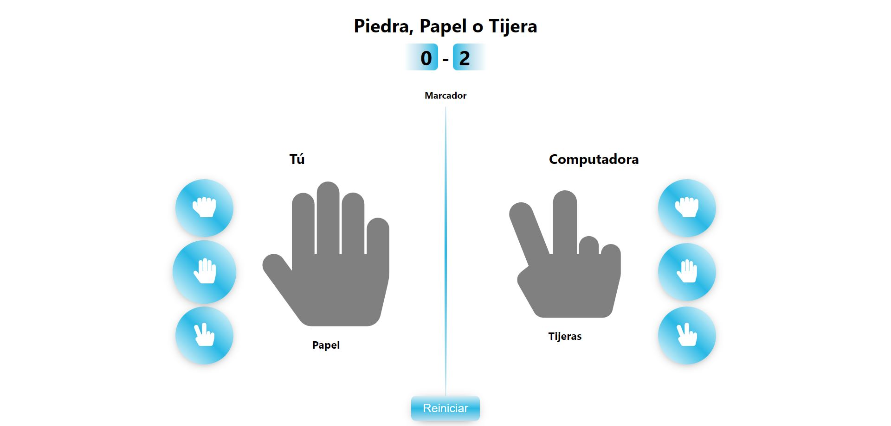

# Piedra, Papel o Tijera

Piedra, Papel o Tijera es un juego clásico en el que el usuario se enfrenta a la computadora en una serie de rondas. Cada jugador elige una de las tres opciones: piedra, papel o tijera, y el ganador de la ronda se determina según las reglas tradicionales del juego. El objetivo es acumular la mayor cantidad de puntos posible al ganar rondas contra la computadora.

## Funcionalidades

- Interfaz intuitiva: Los usuarios pueden seleccionar su jugada haciendo clic en los botones correspondientes para piedra, papel o tijera.
- Partidas contra la computadora: El usuario compite contra la computadora, que elige una jugada al azar en cada ronda.
- Marcador en tiempo real: El marcador muestra el número de rondas ganadas por el jugador y por la computadora, permitiendo un seguimiento del progreso durante la sesión de juego.
- Reinicio de juego: Los usuarios pueden reiniciar la partida en cualquier momento para comenzar una nueva serie de rondas.

## Páginas

- **Inicio**: La página de inicio ofrece una breve introducción al juego y proporciona un enlace para comenzar a jugar.
- **Juego**: La página principal del juego, donde los usuarios interactúan con la interfaz para seleccionar sus jugadas y ver los resultados de cada ronda.
- **Página no encontrada**: En caso de que el usuario acceda a una ruta no válida, se mostrará una página de error personalizada con un mensaje y un enlace para volver a la página de inicio.

## Instalación

1. Clona este repositorio en tu máquina local usando `git clone`.
2. Navega al directorio del proyecto usando `cd nombre-del-proyecto`.
3. Instala las dependencias usando `npm install`.

## Uso

Después de completar la instalación, puedes ejecutar la aplicación usando:

```bash
npm start
```

Esto iniciará la aplicación en tu navegador predeterminado.

## Capturas




